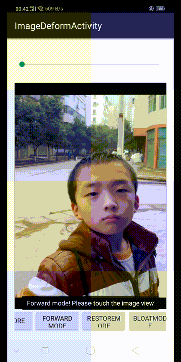

# Android-GPUImage-Plus

Image, Camera And Video Filters Based On OpenGL

>To get pure lib without ffmpeg(No feature of video recording), please checkout the branch [min](https://github.com/wysaid/android-gpuimage-plus/tree/min). The whole jni module will be less than 600KB.

## New Feature

See the `image deform demo`.

 

## Gradle dependency

```gradle
repositories {
    jcenter()
}

//Choose only one of them
dependencies {
    //All arch: armeabi, armeabi-v7a, arm64-v8a, x86
    compile 'org.wysaid:gpuimage-plus:2.6.3'

    //Pure graphics lib without ffmpeg. (all arch for branch 'min')
    compile 'org.wysaid:gpuimage-plus:2.6.3-min'
}
```

> Use other ffmpeg-library, see: <https://github.com/wysaid/FFmpeg-Android.git>

## Abstract

* This repo is an Android Studio Project, comprising "cgeDemo", "library" two sub-modules. Hundreds of built-in filters are available in the demo. 😋If you'd like to add your own filter, please take a look at the manual page. Or you can follow the demo code. The new custom filter should be written in C++.

* Demo and Library will be updated as needed. Welcome for your questions or PR.

* To build with the jni part, pleasae try:

```shell
export NDK=path/of/your/ndk
cd folder/of/jni (android-gpuimage-plus/library/src/main/jni)

#This will make all arch: armeabi, armeabi-v7a arm64-v8a, x86, mips
./buildJNI
#Or use "sh buildJNI"

#Try this if you failed to run the shell above
export CGE_USE_VIDEO_MODULE=1
$NDK/ndk-build

#If you don't want anything except the image filter,
#Do as below to build with only cge module
#No ffmpeg, opencv or faceTracker.
#And remove the loading part of ffmpeg&facetracker
$NDK/ndk-build

#For Window user, you should include the `.cmd` extension to `ndk-build` like this:
cd your_path_to\android-gpuimage-plus-master\library\src\main\jni
your_path_to_ndk\ndk-bundle\ndk-build.cmd

#Also remember to comment out these line in NativeLibraryLoader
//System.loadLibrary("ffmpeg");
//CGEFFmpegNativeLibrary.avRegisterAll();
```

> You can find precompiled libs here: [android-gpuimage-plus-libs](https://github.com/wysaid/android-gpuimage-plus-libs) (The precompiled '.so' files are generated with NDK-r23b)

Note that the generated file "libFaceTracker.so" is not necessary. So just remove this file if you don't want any feature of it.

* iOS version: [https://github.com/wysaid/ios-gpuimage-plus](https://github.com/wysaid/ios-gpuimage-plus "http://wysaid.org")

## Manual

### 1. Usage

___Sample Code for doing a filter with Bitmap___

```java
//Simply apply a filter to a Bitmap.
@Override
protected void onCreate(Bundle savedInstanceState) {
    super.onCreate(savedInstanceState);
    setContentView(R.layout.activity_main);

    Bitmap srcImage = ...;

    //HSL Adjust (hue: 0.02, saturation: -0.31, luminance: -0.17)
    //Please see the manual for more details.
    String ruleString = "@adjust hsl 0.02 -0.31 -0.17";

    Bitmap dstImage = CGENativeLibrary.filterImage_MultipleEffects(src, ruleString, 1.0f);

    //Then the dstImage is applied with the filter.
    //It's so convenient, isn't it?

    //Save the result image to /sdcard/libCGE/rec_???.jpg.
    ImageUtil.saveBitmap(dstImage);
}
```

### 2. Custom Shader Filter

#### 2.1 Write your own filter

>Your filter must inherit [CGEImageFilterInterfaceAbstract](https://github.com/wysaid/android-gpuimage-plus/blob/master/library/src/main/jni/include/cgeImageFilter.h#L42) or its child class. Most of the filters are inherited from [CGEImageFilterInterface](https://github.com/wysaid/android-gpuimage-plus/blob/master/library/src/main/jni/include/cgeImageFilter.h#L57) because it has many useful functions.

```cpp
// A simple customized filter to do a color reversal.
class MyCustomFilter : public CGE::CGEImageFilterInterface
{
public:
    
    bool init()
    {
        CGEConstString fragmentShaderString = CGE_SHADER_STRING_PRECISION_H
        (
        varying vec2 textureCoordinate;  //defined in 'g_vshDefaultWithoutTexCoord'
        uniform sampler2D inputImageTexture; // the same to above.

        void main()
        {
            vec4 src = texture2D(inputImageTexture, textureCoordinate);
            src.rgb = 1.0 - src.rgb;  //Simply reverse all channels.
            gl_FragColor = src;
        }
        );

        //m_program is defined in 'CGEImageFilterInterface'
        return m_program.initWithShaderStrings(g_vshDefaultWithoutTexCoord, s_fsh);
    }

    //void render2Texture(CGE::CGEImageHandlerInterface* handler, GLuint srcTexture, GLuint vertexBufferID)
    //{
    //  //Your own render functions here.
    //  //Do not override this function to use the CGEImageFilterInterface's.
    //}
};
```

>Note: To add your own shader filter with c++. [Please see the demo for further details](https://github.com/wysaid/android-gpuimage-plus/blob/master/library/src/main/jni/source/customFilter_N.cpp).

#### 2.2 Run your own filter

__In C++, you can use a CGEImageHandler to do that:__

```cpp
//Assume the gl context already exists:
//JNIEnv* env = ...;
//jobject bitmap = ...;
CGEImageHandlerAndroid handler;
CustomFilterType* customFilter = new CustomFilterType();

//You should handle the return value (false is returned when failed.)
customFilter->init();
handler.initWithBitmap(env, bitmap);

//The customFilter will be released when the handler' destructor is called.
//So you don't have to call 'delete customFilter' if you add it into the handler.
handler.addImageFilter(customFilter);

handler.processingFilters(); //Run the filters.

jobject resultBitmap = handler.getResultBitmap(env);
```

>If no gl context exists, the class [CGESharedGLContext](https://github.com/wysaid/android-gpuimage-plus/blob/master/library/src/main/jni/interface/cgeSharedGLContext.h#L22) may be helpful.

__In Java, you can simply follow the sample:__

See: [CGENativeLibrary.cgeFilterImageWithCustomFilter](https://github.com/wysaid/android-gpuimage-plus/blob/master/cgeDemo/src/main/java/org/wysaid/cgeDemo/TestCaseActivity.java#L123)

__Or to do with a [CGEImageHandler](https://github.com/wysaid/android-gpuimage-plus/blob/master/library/src/main/java/org/wysaid/nativePort/CGEImageHandler.java#L93)__

### 3. Filter Rule String ###

Doc: <https://github.com/wysaid/android-gpuimage-plus/wiki>

En: [https://github.com/wysaid/android-gpuimage-plus/wiki/Parsing-String-Rule-(EN)](https://github.com/wysaid/android-gpuimage-plus/wiki/Parsing-String-Rule-(EN) "http://wysaid.org")

Ch: [https://github.com/wysaid/android-gpuimage-plus/wiki/Parsing-String-Rule-(ZH)](https://github.com/wysaid/android-gpuimage-plus/wiki/Parsing-String-Rule-(ZH) "http://wysaid.org")

## Tool

Some utils are available for creating filters: [https://github.com/wysaid/cge-tools](https://github.com/wysaid/cge-tools "http://wysaid.org")

[](https://github.com/wysaid/cge-tools)

## License

[MIT License](https://github.com/wysaid/android-gpuimage-plus/blob/master/LICENSE)

## Donate

Alipay:


Paypal:

[](http://blog.wysaid.org/p/donate.html)
